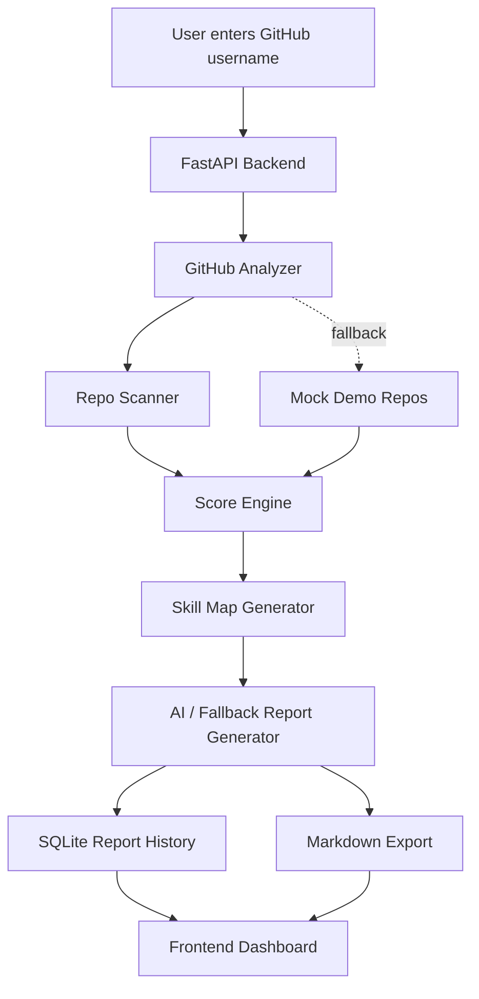
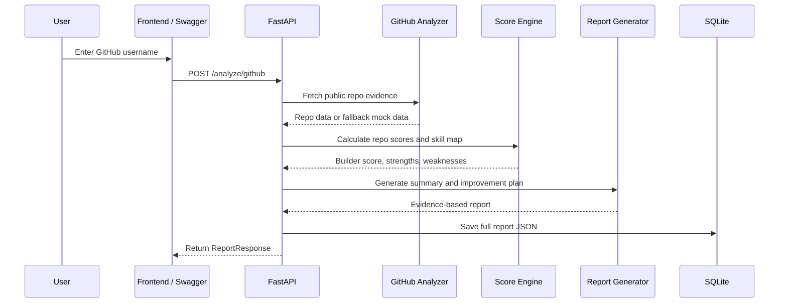

# SkillProof AI

<p align="center">
  <strong>Your projects speak louder than your resume.</strong>
</p>

<p align="center">
  <em>A proof-of-skill engine that analyzes public GitHub projects and generates structured developer skill reports based on real project evidence.</em>
</p>

<p align="center">
  
  
  
  
  
</p>

<p align="center">
  
  
  
  
</p>

---

## Overview

**SkillProof AI** is a proof-of-skill platform that analyzes a developer's public GitHub profile and generates a structured report based on real project evidence.

Instead of relying on resume claims like:

> “I know AI.”  
> “I am a cybersecurity learner.”  
> “I am a full-stack developer.”

SkillProof AI checks actual project signals such as:

- Public repositories
- README quality
- Project structure
- Backend/frontend evidence
- AI/security signals
- Deployment readiness
- Testing and documentation habits
- Recent activity
- Project consistency

The result is a clear **Builder Score**, **Skill Map**, **Strong Areas**, **Weak Areas**, and an exportable **Markdown proof report**.

---

## One-Line Pitch

> **SkillProof AI turns a developer's GitHub projects into a structured proof-of-skill report.**

---

## Why SkillProof AI?

Many young developers, students, hackathon participants, and self-taught builders have real projects, but their skills are often hard to prove from a resume alone.

SkillProof AI helps answer questions like:

- Does this developer actually build projects?
- Are their repositories documented?
- Do they have frontend, backend, AI, or security evidence?
- Are their projects deployed?
- Do they write complete MVPs or only small experiments?
- What are their strongest technical areas?
- What should they improve next?

SkillProof AI does **not** judge a person's full ability.  
It analyzes only **public project evidence**.

---

## MVP Features

### GitHub Username Analyzer

Enter a GitHub username and generate a structured profile report.

```text
GitHub username → repo scan → scoring → skill map → report → markdown export
```

### Builder Score

A 0–100 public evidence score based on project quality signals.

Example:

```text
Builder Score: 84/100
```

### Skill Map

SkillProof AI generates category-level scores:

```json
{
  "AI / ML": 78,
  "Cybersecurity": 86,
  "Frontend": 70,
  "Backend": 74,
  "Data Science": 55,
  "Documentation": 61,
  "Deployment": 66,
  "Project Complexity": 80,
  "Consistency": 72
}
```

### Repo Analysis

Each repository receives:

- Project type detection
- Evidence flags
- Repo-level score
- Findings and recommendations

### AI/Fallback Report Generator

The MVP works without OpenAI, Gemini, or any paid AI API.

If no AI API is configured, SkillProof AI uses a rule-based fallback generator to create an honest evidence-based summary.

### Markdown Export

Reports can be exported as clean Markdown for:

- Portfolios
- Hackathon applications
- Team recruitment
- Mentorship reviews
- GitHub profile documentation

### SQLite History

Generated reports are saved locally in SQLite.

---

## Current MVP Status

| Module | Status |
|---|---|
| FastAPI backend | Ready |
| Pydantic models | Ready |
| Rule-based score engine | Ready |
| Fallback report generator | Ready |
| SQLite report history | Ready |
| Markdown export | Ready |
| Swagger API docs | Ready |
| GitHub scanner integration | Ready |
| Repo evidence scanner | Ready |
| Minimal frontend dashboard | Ready |
| Polished React dashboard | In progress |
| AI API integration | Optional future upgrade |

---

## Tech Stack

### Backend

| Tool | Purpose |
|---|---|
| FastAPI | Backend API |
| Python | Core logic |
| Pydantic | Request/response validation |
| SQLite | Local report history |
| Uvicorn | ASGI server |
| GitHub API | Public repository data |
| python-dotenv | Environment variables |

### Frontend

Planned frontend stack:

| Tool | Purpose |
|---|---|
| React | UI framework |
| Vite | Frontend tooling |
| Tailwind CSS | Styling |
| Recharts | Skill charts |
| Lucide Icons | Dashboard icons |

---

## Architecture



---

## Backend Flow



---

## Scoring System

SkillProof AI calculates scores from public project evidence.

### Repo Score

| Signal | Points |
|---|---:|
| README exists | +15 |
| Good README length | +10 |
| Live demo exists | +10 |
| requirements.txt or package.json exists | +10 |
| Multiple files | +10 |
| Backend or frontend logic | +15 |
| AI or security signal | +15 |
| Recently updated | +10 |
| License or .gitignore | +5 |
| Fork penalty | -15 |

Final repo score is clamped between 0 and 100.

---

### Builder Score Formula

```text
Final Builder Score =
  Average Repo Quality * 0.35
+ Skill Depth * 0.25
+ Documentation * 0.15
+ Deployment * 0.10
+ Activity * 0.10
+ Consistency * 0.05
```

---

## Project Structure

```text
SkillProof_AI/
├── backend/
│   ├── main.py
│   ├── models.py
│   ├── score_engine.py
│   ├── ai_report.py
│   ├── database.py
│   ├── requirements.txt
│   ├── .env.example
│   └── skillproof.db
│
├── docs/
│   ├── API_SPEC.md
│   └── DEMO_SCRIPT.md
│
├── README.md
└── .gitignore
```

---

## Backend Modules

### `main.py`

FastAPI app and API endpoints.

Responsibilities:

- Create FastAPI application
- Enable CORS
- Validate requests
- Run analysis flow
- Return report response
- Export Markdown
- Save report history

---

### `models.py`

Pydantic request/response models.

Includes:

- `AnalyzeGithubRequest`
- `Finding`
- `RepoAnalysis`
- `ReportResponse`
- `HistoryItem`
- `ErrorResponse`

---

### `score_engine.py`

Rule-based scoring logic.

Includes:

- Repo scoring
- Skill map generation
- Builder score calculation
- Main identity detection
- Strong/weak area detection
- Suggested role generation

---

### `ai_report.py`

Fallback report generation.

The MVP does not require paid AI APIs.

Includes:

- Evidence-based summary
- Improvement plan
- Future-ready AI integration placeholder

---

### `database.py`

SQLite persistence layer.

Includes:

- Database initialization
- Report saving
- Report loading
- History listing

---

## Setup

### 1. Clone the repository

```bash
git clone https://github.com/BeBecpp/SkillProof_AI.git
cd SkillProof_AI
```

---

### 2. Go to backend folder

```bash
cd backend
```

---

### 3. Create virtual environment

#### Windows

```bash
python -m venv .venv
.venv\Scripts\activate
```

#### macOS / Linux

```bash
python -m venv .venv
source .venv/bin/activate
```

---

### 4. Install dependencies

```bash
pip install -r requirements.txt
```

---

### 5. Create environment file

Copy `.env.example` to `.env`.

#### Windows

```bash
copy .env.example .env
```

#### macOS / Linux

```bash
cp .env.example .env
```

Example `.env`:

```env
# Optional GitHub token for higher rate limits
GITHUB_TOKEN=

# AI API is optional. MVP works without this.
AI_PROVIDER=
OPENAI_API_KEY=
GEMINI_API_KEY=
```

---

### 6. Run backend

```bash
uvicorn main:app --reload
```

Backend will run at:

```text
http://127.0.0.1:8000
```

Swagger docs:

```text
http://127.0.0.1:8000/docs
```

---

## API Endpoints

| Method | Endpoint | Description |
|---|---|---|
| GET | `/` | API info |
| GET | `/health` | Health check |
| POST | `/analyze/github` | Analyze GitHub username |
| GET | `/demo/report` | Generate mock demo report |
| GET | `/history` | List saved reports |
| GET | `/report/{report_id}` | Get saved report |
| GET | `/report/{report_id}/markdown` | Export report as Markdown |

---

## Example Request

```http
POST /analyze/github
Content-Type: application/json
```

```json
{
  "username": "BeBecpp"
}
```

---

## Example Response

```json
{
  "id": "report_001",
  "username": "BeBecpp",
  "avatar_url": "https://github.com/BeBecpp.png",
  "github_url": "https://github.com/BeBecpp",
  "builder_score": 84,
  "main_identity": "AI + Cybersecurity Builder",
  "skill_map": {
    "AI / ML": 78,
    "Cybersecurity": 86,
    "Frontend": 70,
    "Backend": 74,
    "Data Science": 55,
    "Documentation": 61,
    "Deployment": 66,
    "Project Complexity": 80,
    "Consistency": 72
  },
  "strong_areas": [
    "Practical AI project building",
    "Cybersecurity / CTF tooling",
    "Backend API development"
  ],
  "weak_areas": [
    "Missing tests",
    "Few deployed demos",
    "Inconsistent README quality"
  ],
  "suggested_roles": [
    "Junior AI Builder",
    "Cybersecurity / CTF Learner",
    "MVP Developer"
  ],
  "repos": [],
  "ai_summary": "This developer shows hands-on project building based on public GitHub evidence.",
  "improvement_plan": [
    "Add setup instructions to important READMEs.",
    "Add tests for core backend logic.",
    "Deploy 1–2 strongest projects publicly."
  ],
  "created_at": "2026-05-26T12:00:00"
}
```

---

## Markdown Export Example

```markdown
# SkillProof Report — BeBecpp

## Builder Score

84/100

## Main Identity

AI + Cybersecurity Builder

## Strong Areas

- Practical AI project building
- Cybersecurity / CTF tooling
- Backend API development

## Weak Areas

- Missing tests
- Few deployed demos
- Inconsistent README quality

## Disclaimer

SkillProof AI analyzes public project evidence only. It does not measure full human potential.
```

---

## Deployment

### Render Backend Deployment

Recommended Render settings:

| Setting | Value |
|---|---|
| Service Type | Web Service |
| Runtime | Python |
| Root Directory | `backend` |
| Build Command | `pip install -r requirements.txt` |
| Start Command | `uvicorn main:app --host 0.0.0.0 --port $PORT` |
| Health Check Path | `/health` |

Environment variables:

```env
GITHUB_TOKEN=
AI_PROVIDER=
OPENAI_API_KEY=
GEMINI_API_KEY=
```

---

## Frontend Integration

Frontend should use this backend base URL:

```env
VITE_API_BASE_URL=http://127.0.0.1:8000
```

For deployed backend:

```env
VITE_API_BASE_URL=https://your-render-service.onrender.com
```

Example frontend request:

```js
const response = await fetch(`${import.meta.env.VITE_API_BASE_URL}/analyze/github`, {
  method: "POST",
  headers: {
    "Content-Type": "application/json",
  },
  body: JSON.stringify({
    username: "BeBecpp",
  }),
});

const report = await response.json();
```

---

## Integration Contract for GitHub Scanner

The backend is designed to work before the real GitHub scanner is complete.

When `github_analyzer.py` is available, it should expose one of these functions:

```python
def analyze_user(username: str) -> dict:
    ...
```

or:

```python
def analyze_github_user(username: str) -> dict:
    ...
```

Expected return shape:

```python
{
    "username": "BeBecpp",
    "avatar_url": "https://github.com/BeBecpp.png",
    "github_url": "https://github.com/BeBecpp",
    "repos": [
        {
            "name": "project-name",
            "url": "https://github.com/BeBecpp/project-name",
            "description": "Project description",
            "language": "Python",
            "stars": 0,
            "forks": 0,
            "updated_at": "2026-05-26",
            "created_at": "2026-05-20",
            "has_readme": True,
            "readme_length": 1200,
            "has_live_demo": False,
            "has_backend": True,
            "has_frontend": False,
            "has_ai": True,
            "has_security": False,
            "has_tests": False,
            "has_docker": False,
            "is_fork": False,
            "file_count": 25,
            "folder_count": 6,
            "has_requirements": True,
            "has_package_json": False,
            "has_license": True,
            "has_gitignore": True,
            "recently_updated": True,
            "project_types": ["AI / ML", "Backend"],
            "findings": []
        }
    ]
}
```

If the scanner is missing, the backend uses realistic mock repositories for demo safety.

---

## Team

| Member | Role | Responsibilities |
|---|---|---|
| BeBe / Nero_404 | AI + Product + Backend Lead | Backend API, scoring, fallback report, SQLite, docs, product story |
| Khuslen / FluxKnight | GitHub Scanner + Security Logic + Frontend Lead | GitHub API fetch, repo scanning, security checks, dashboard UI, deployment |

---

## Demo Script

```text
Hi, this is SkillProof AI.

The problem is simple: many developers say they know AI, cybersecurity, or full-stack development, but it is hard to verify their real ability from a resume alone.

SkillProof AI analyzes public GitHub projects and generates a proof-of-skill report based on real shipped work.

First, I enter a GitHub username.

The system scans public repositories, checks README files, detects project types, scans for AI, security, frontend, backend, deployment, and documentation signals, then calculates a builder score.

Here we can see the developer's main identity, skill map, strong areas, weak areas, and repo-level analysis.

The report can also be exported as Markdown and used in a portfolio, hackathon application, mentorship review, or team recruitment process.

This MVP was built by two young developers combining backend engineering, cybersecurity logic, AI-assisted product thinking, and frontend dashboard design.
```

---

## Roadmap

### MVP

- [x] FastAPI backend
- [x] Pydantic models
- [x] Rule-based scoring
- [x] Fallback report generator
- [x] SQLite report history
- [x] Markdown export
- [x] Swagger API docs
- [x] Real GitHub scanner
- [x] Repo evidence scanner
- [x] Minimal frontend dashboard
- [ ] Polished React dashboard

### v1.1

- [ ] Team compatibility report
- [ ] Portfolio URL analyzer
- [ ] PDF export
- [ ] Public share link
- [ ] Better GitHub API caching
- [ ] CI/CD checks

### v1.2

- [ ] Optional OpenAI/Gemini report enhancement
- [ ] Recruiter view
- [ ] Resume comparison
- [ ] Private repo support with consent
- [ ] Organization/team analysis

---

## GitHub Topics

Recommended repository topics:

```text
ai
github-api
developer-tools
portfolio
skill-assessment
fastapi
react
cybersecurity
student-project
mvp
proof-of-skill
developer-portfolio
```

---

## Product Ethics

SkillProof AI should not say:

```text
This person is bad.
This person cannot code.
This person is not talented.
```

SkillProof AI should say:

```text
Public project evidence is limited.
Documentation can be improved.
More deployed projects would strengthen this profile.
Testing and setup instructions are missing.
```

Correct framing:

> SkillProof AI analyzes public project evidence. It does not measure full human potential.

---

## Disclaimer

SkillProof AI is an MVP project evidence analyzer.

It does not measure a person's full intelligence, potential, creativity, or future ability. It only analyzes visible public GitHub project signals and generates an evidence-based report.

Scores should be treated as **project evidence scores**, not absolute human skill scores.

---

## License

This project is released under the MIT License.

---

## Final Pitch

**SkillProof AI helps young developers prove what they can actually build.**

Instead of judging people by resumes or self-claimed skills, it analyzes real GitHub projects, detects technical evidence, calculates a builder score, and generates a clear proof-of-skill report.

> Resume биш. Claim биш. Харин project-based proof.
